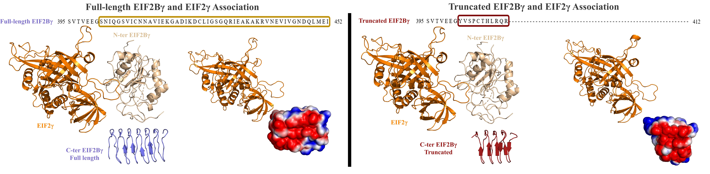

# Structural modeling of EIF2γ:EIF2Bγ interface (both truncated and full-length isoforms)

This work presents the structural part of the "A C-term truncated EIF2Bγ protein encoded by an intronically polyadenylated isoform introduces unfavorable EIF2Bγ-EIF2γ interactions" study by Ayca Circir, Gozde Koksal Bicakci, Busra Savas, Didem Naz Doken, Onur Henden, Tolga Can, Ezgi Karaca, Ayse Elif Erson-Bensan (Circir et al., 2021).

[](https://doi.org/10.1002/prot.26284)



## Motivation
EIF2 (GTPase) facilitates AUG start codon recognition. During translation initiation, EIF2 interacts with EIF2B, the guanine nucleotide exchange factor (GEF) (Fig 1). Under stress-induced conditions EIF2α (the α of EIF2) becomes phosphorylated, leading to its interaction with the γ subunit of EIF2B (EIF2Bγ, PDB: 6K72)1. In this state, EIF2B is inhibited, triggering an internal stress response (ISR) (Fig 1). Deregulated ISR is linked to neurodegenerative disorders and cancer. 

Our experimental collaborators characterized a minor EIF2Bγ isoform in breast cancer cells2. In this isoform, 51 amino acids at the C-terminal domain of EIF2Bγ are replaced with a “YVSPCTHLRQR” sequence (the truncated isoform, Fig. 2). In this work, we aim to reveal the impact of this C-terminally truncated EIF2Bγ isoform on the EIF2:EIF2B interaction. 


## Our folders describe:

- **Models:** contains the PDB files of C-terminal domain of both isoforms modelled with I-TASSER, iDrug, TrRosetta, Ab-initio Rosetta and QUARK servers. 
- **Initial_structures:** contains all the relevant input files for HADDOCK runs.
- **HADDOCK_runs:** contains the HADDOCK output files of truncated and full-length isoforms.
- **PQR_files:** contains the input (PDB) and output (PQR) files obtained by PDB2PQR server.
- **Graph:** contains the electrostatics energy per residue files obtained by HADDOCK, scripts to obtained the electrostatics energies of the best four complexes, excel file including desired values, graph, jupyter notebook script to obtain the graph along with data file. 


  
## To clone the repository

```
git clone https://github.com/CSB-KaracaLab/eif2g-eif2bg-ints.git
```
or if you would like to get the content directly via wget:
```
wget https://github.com/CSB-KaracaLab/eif2g-eif2bg-ints/archive/master.zip
```

## References & Citations

Kashiwagi K, Yokoyama T, Nishimoto M, Takahashi M, Sakamoto A, Yonemochi M et al. Structural basis for eIF2B inhibition in integrated stress response. Science (80- ) 2019; 364: 495–499.

Circir, A, Koksal Bicakci, G, Savas, B, et al. A C-term truncated EIF2Bγ protein encoded by an intronically polyadenylated isoform introduces unfavorable EIF2Bγ–EIF2γ interactions. Proteins. 2022; 90( 3): 889- 897. doi:10.1002/prot.26284

## Acknowledgements
This research is supported by EMBO installation grant( (#4421). 

## Contact 
ezgi.karaca@ibg.edu.tr
